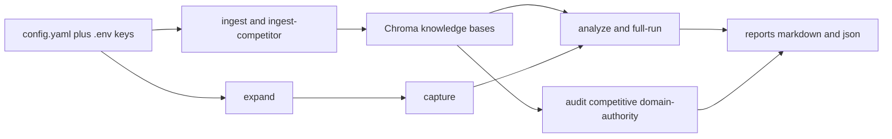

# Citewatch

Bring-your-own-keys CLI that measures how generative models cite — or ignore — your brand versus competitors.

You point it at a site, capture answers from Claude and Gemini, and get a structured report: mention status, citations, and recommended content fixes. That practice is often called **GEO** (Generative Engine Optimization). Citewatch is the local tool; the keys stay on your machine.

**Requirements:** Python 3.11+, an [Anthropic](https://console.anthropic.com/settings/keys) key (Claude). A [Google AI](https://aistudio.google.com/apikey) key is optional (Gemini). [Ollama](https://ollama.com) with `nomic-embed-text` is optional; without it, Citewatch falls back to a local MiniLM model.

## Quick start

```bash
git clone https://github.com/ManikaMalhotra/citewatch.git
cd citewatch
chmod +x setup.sh && ./setup.sh
```

Or by hand:

```bash
python3 -m venv .venv
source .venv/bin/activate
pip install -e .
cp .env.example .env
```

1. Put `ANTHROPIC_API_KEY` (and optionally `GOOGLE_API_KEY`) in `.env`. Never put keys in `config.yaml`.
2. Edit `config.yaml`: `target.name`, `target.domain`, `target.description`, and `competitors`.
3. Run:

```bash
source .venv/bin/activate
citewatch status
citewatch ingest
citewatch expand "best notes app for teams"
citewatch full-run "best notes app for teams" -m haiku
```

Reports land in `reports/<date>/` as Markdown and JSON.

## Architecture



| Stage | What it does |
|-------|----------------|
| **Config** | YAML describes the brand, competitors, model aliases, crawl limits. `.env` holds API keys. |
| **Ingest** | Sitemap → polite crawl → heading-aware chunks → embeddings into a local Chroma KB. |
| **Expand** | Seed query → intent variants (beginner, troubleshooting, comparison, best-tool, enterprise) with an embedding diversity filter. |
| **Capture** | Claude / Gemini answers, parsed for brand mentions and citations, cached by SHA256(`query\|model_id\|api\|temperature`). |
| **Analyze** | Retrieve supporting chunks from the KB, run a GEO judge, write Markdown + JSON. |
| **Audit** | On-site SEO heuristics, competitor crawl, keyword gaps, optional article-pair comparison. |

Embeddings prefer Ollama `nomic-embed-text` when `http://localhost:11434` is up; otherwise Chroma’s bundled `all-MiniLM-L6-v2`. Local stores:

| Path | Contents |
|------|----------|
| `.citewatch_kb/` | Target site chunks |
| `.citewatch_competitor_kb/` | Competitor chunks |
| `.citewatch_cache/` | Captured answers |
| `reports/<date>/` | Markdown + JSON |
| `config.yaml` | Brand / crawl / models |
| `.env` | API keys (gitignored) |

## CLI reference

Queries are **positional** (not `--query`). Model aliases come from `config.yaml`: `opus`, `sonnet`, `haiku`, `pro`, `flash`.

| Command | Purpose | Provider API | Embeddings |
|---------|---------|--------------|------------|
| `expand` | Query variants | yes | yes (diversity filter) |
| `capture` | Capture model answers | yes | no |
| `analyze` | GEO citation audit | yes | yes (KB retrieve) |
| `ingest` | Crawl target site | no | yes |
| `ingest-competitor` | Crawl competitor sites | no | yes |
| `domain-authority` | Volume / topic comparison | no | yes |
| `audit` | On-site SEO heuristics | no | yes |
| `full-run` | expand → capture → analyze | yes | yes |
| `competitive` | Keywords, gaps, article pairs | optional | yes |
| `status` | Health check | no | optional |

### `expand`

```bash
citewatch expand "best notes app for teams"
citewatch expand "Notion vs Obsidian for wikis" -n 10 -t 0.80
```

| Flag | Default | Description |
|------|---------|-------------|
| `QUERY` | required | Seed query |
| `-n, --num` | 5 | Variant count |
| `-t, --threshold` | 0.85 | Cosine diversity cutoff |

### `capture`

```bash
citewatch capture "best notes app for teams"
citewatch capture "how to share a team wiki" -m "opus,sonnet,haiku,pro,flash"
citewatch capture "best notes app for teams" -m flash --expand
```

| Flag | Default | Description |
|------|---------|-------------|
| `QUERY` | required | Prompt |
| `-m, --models` | `haiku` | Comma-separated aliases |
| `-e, --expand` | false | Capture seed + variants |

Delete `.citewatch_cache` to force a refresh.

### `analyze`

```bash
citewatch analyze "best notes app for teams" -m flash
citewatch analyze "Notion vs Obsidian for wikis" -m sonnet --compare "notion,obsidian"
citewatch analyze "team knowledge base tools" --fail-on-rate-limits
```

| Flag | Default | Description |
|------|---------|-------------|
| `QUERY` | required | Query to audit |
| `-m, --models` | `haiku` | Capture models |
| `-c, --compare` | config competitors | Extra brand names |
| `--skip-rate-limits` / `--fail-on-rate-limits` | skip | Partial report vs exit 1 |

Requires a populated KB for grounded judging (`citewatch ingest` first).

### `ingest`

```bash
citewatch ingest
citewatch ingest -s https://docs.example.com -d 6
```

| Flag | Default | Description |
|------|---------|-------------|
| `-s, --site` | `https://<target.domain>` | Origin |
| `-d, --max-depth` | 4 | URL path depth |
| `-u, --update` | false | Incremental (etag headers) |

### `ingest-competitor`

```bash
citewatch ingest-competitor
citewatch ingest-competitor -c "notion.so,obsidian.md" -n 200 -d 5 --delay 2.0
```

| Flag | Default | Description |
|------|---------|-------------|
| `-c, --competitors` | config.yaml | Hosts |
| `-d, --max-depth` | 3 | Path depth |
| `-n, --max-urls` | 100 | Per domain |
| `--delay` | 1.0 | Seconds between requests |

### `domain-authority`

```bash
citewatch domain-authority
citewatch domain-authority -c "notion.so,obsidian.md"
```

Requires prior `ingest` and `ingest-competitor`. Topics come from `audit.coverage_topics`.

### `audit`

```bash
citewatch audit
citewatch audit --gsc-csv data/gsc_export.csv --ahrefs-csv data/ahrefs.csv
```

Optional CSVs: Google Search Console and Ahrefs keyword exports. Drop files under `data/` (gitignored except `.gitkeep`).

### `full-run`

```bash
citewatch full-run "best notes app for teams" -m flash
citewatch full-run "Notion vs Obsidian for wikis" -m "sonnet,pro,flash"
```

Variant count = `expander.num_variants` in config. `--skip-ingest` is accepted but ingestion remains a separate command.

| Flag | Default | Description |
|------|---------|-------------|
| `QUERY` | required | Seed query |
| `-m, --models` | `haiku` | Capture models |
| `--skip-ingest` | false | Flag only; does not crawl |
| `--skip-rate-limits` / `--fail-on-rate-limits` | skip | Partial report vs exit 1 |

### `competitive`

```bash
citewatch competitive -k "best notes app,notion vs obsidian"
citewatch competitive -k "team wiki" --crawl-competitors -n 5 -m flash
citewatch competitive --gsc-csv data/gsc.csv --ahrefs-csv data/ahrefs.csv --crawl-competitors -n 10
```

| Flag | Default | Description |
|------|---------|-------------|
| `-k, --keywords` | empty | CLI keywords |
| `--gsc-csv` / `--ahrefs-csv` | none | Search exports |
| `-c, --competitors` | config | Hosts |
| `-n, --top-n` | 10 | Article pairs |
| `--crawl-competitors` | false | Enable crawl |
| `-m, --models` | `flash` | Comparison model |
| `--max-urls` | 50 | Per-domain crawl cap |

### `status`

```bash
citewatch status
```

Prints target domain, whether keys are set, embedding health, and KB/cache sizes.

## Configuration

### `config.yaml`

| Key | Role |
|-----|------|
| `target` | Brand name, domain, sitemap, product description, topic context |
| `competitors` | Names + domains to detect and crawl |
| `brands.detect` | Extra strings to scan in answers |
| `models` | Aliases → provider model IDs |
| `expander` | Variant count, diversity cutoff, intent categories |
| `capture` | Temperature, tokens, concurrency, retries |
| `cache` / `ingestion` | Local Chroma paths, crawl politeness, user-agent |
| `audit` | Cannibalization threshold, coverage topics |
| `reports` | Output directory and formats |

Override the YAML path with `CITEWATCH_CONFIG`.

### Environment

| Variable | Purpose |
|----------|---------|
| `ANTHROPIC_API_KEY` | Claude (`opus`, `sonnet`, `haiku`) |
| `GOOGLE_API_KEY` | Gemini (`pro`, `flash`) — optional |
| `OLLAMA_BASE_URL` | Embeddings (default `http://localhost:11434`) |
| `CITEWATCH_CONFIG` | Path to YAML (default `./config.yaml`) |

Copy `.env.example` → `.env`. Keys are never read from YAML.

## License

MIT. See [LICENSE](LICENSE).
